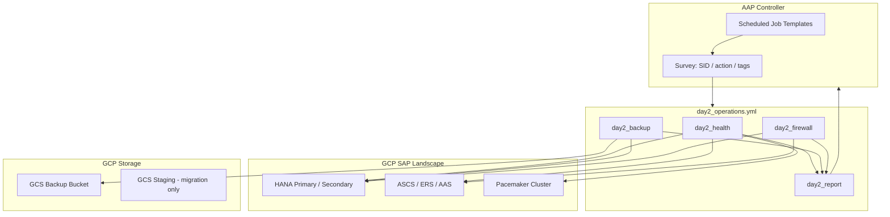

# Day 2 Operations — PPT Slide Pack

## Slide title

**Day 2 Operations — SAP on GCP (Post-Migration Steady State)**

---

## Bullet points (same style as STONITH/SBD slide)

### Operational Model

**Steady-State Automation**  
Migration workflow ends at cutover; Day 2 runs on a recurring AAP schedule against `gcp_sap` inventory.

**Tagged Playbook**  
`day2_operations.yml` supports selective runs: `day2_health`, `day2_backup`, `day2_firewall`, `day2_report`.

**Certified Collections**  
`sap.sap_operations` (Backint, firewall, sap_control) + `google.cloud` (GCS bucket) + `community.sap_libs` (health probes).

---

### Health & Availability

**SAP Process Probe**  
`sapcontrol` / `GetProcessList` on HANA; `GetSystemInstanceList` on ASCS/ERS/AAS — GREEN required.

**Pacemaker Audit**  
`pcs status --full` on all cluster nodes — no failed resources before close of maintenance window.

**HSR State Check**  
`hdbnsutil -sr_state` on HANA primary — replication ACTIVE post-migration.

**Fail-Fast Reporting**  
`set_stats` aggregates health to AAP job artifacts; optional fail when cluster unhealthy.

---

### Backup & Recovery

**Backint → GCS**  
HANA backups land in dedicated GCS bucket (`{project}-sap-migration-backups`), separate from system-copy staging.

**Three Actions**  
`setup` (one-time), `backup` (scheduled), `clean` (retention) — driven by `day2_backint_action`.

**Retention Tier**  
Configurable retention days; cleanup via `sap_hana_backint` clean action — prevents unbounded storage cost.

**RPO Alignment**  
Nightly backup job + 4-hourly health — RPO/RTO documented in runbook, not implied by migration alone.

---

### Security & Compliance

**Firewall Drift**  
Optional `sap_firewall` remediation; default is detect-only via GCP instance tag audit.

**Credential Isolation**  
GCP SA for GCS backup scoped to backup bucket; SSH for SAP ops separate from cloud API creds.

**No Azure Day 2**  
Source cloud removed from steady-state path after decommission — single control plane on GCP.

---

### AAP Integration

**Job Template**  
`SAP Day2 Operations` — same EE as migration; survey: `sap_sid`, `day2_backint_action`, tags.

**Schedules**  
Health every 4h; backup daily 02:00; firewall audit weekly — map to `day2_schedule` in group_vars.

**Notifications**  
Hook AAP notification templates on job failure — route to Basis / platform channels.

---

### Known Issues

**Backint Setup**  
First backup requires `day2_backint_setup_if_missing=true` — one-time elevated run on HANA primary.

**Role Availability**  
`sap.sap_operations` variable names differ by version — validate in DEV EE before production schedule.

**Starvation Under Backup**  
Full HANA backup during peak load may slow app tier — align backup window with SAP batch schedule.

**Certificate / Kernel Drift**  
Day 2 health does not patch SAP kernel or renew certs — separate change workflows required.

---

## Mermaid — Day 2 operations flow (paste into PPT or mermaid.live)



---

## PPT block diagram — Lifecycle (replaces Mermaid timeline)

Use **SmartArt → Process → Chevron List** or two horizontal chevron rows.

**Row 1 label:** `MIGRATION (one-time)`

```
[Discovery] → [Greenfield] → [System Copy] → [Cutover]
 Azure         GCP shell      Export/GCS       DNS/VIP
 inventory     + HA build     Import           switch
```

| Box | Subtitle (smaller text under box) |
|-----|-----------------------------------|
| Discovery | Azure inventory |
| Greenfield | GCP shell + HA |
| System Copy | Export / GCS / Import |
| Cutover | DNS + VIP switch |

**Row 2 label:** `DAY 2 (ongoing)`

```
[Health] → [Backup] → [Compliance] → [Optimize]
 every 4h    nightly     weekly         30 days
 sapcontrol  Backint→GCS firewall      right-size
 pcs + HSR   to GCS      audit
```

| Box | Subtitle |
|-----|----------|
| Health | 4-hourly sapcontrol + pcs + HSR |
| Backup | Nightly Backint to GCS |
| Compliance | Weekly firewall audit |
| Optimize | Right-size review at 30 days |

**Vertical alternative (one column, two swimlanes):**

```
┌──────────────── MIGRATION (one-time) ────────────────┐
│  Discovery → Greenfield → System Copy → Cutover     │
└──────────────────────────┬───────────────────────────┘
                           │ cutover complete
┌──────────────── DAY 2 (ongoing) ───────────────────┐
│  Health → Backup → Compliance → Optimize           │
└──────────────────────────────────────────────────────┘
```

---

## PPT block diagram — Backup tier (replaces Mermaid flowchart)

Use **SmartArt → Process → Basic Process** (left to right, 5 boxes).

```
[HANA Primary] → [Backint Agent] → [GCS Backup Bucket] → [14-day retention] → [Quarterly DR drill]
                      hdbbackint         gcp_gcs            clean job            restore test
```

| # | Box title | Arrow label (optional) |
|---|-----------|----------------------|
| 1 | HANA Primary | — |
| 2 | Backint Agent | hdbbackint |
| 3 | GCS Backup Bucket | gcp_gcs |
| 4 | 14-day retention | retention clean |
| 5 | Quarterly DR drill | restore test |

**Stacked variant (if slide is narrow):**

```
        ┌─────────────────┐
        │  HANA Primary   │
        └────────┬────────┘
                 │ hdbbackint
                 ▼
        ┌─────────────────┐
        │  Backint Agent  │
        └────────┬────────┘
                 │ gcp_gcs
                 ▼
        ┌─────────────────┐
        │ GCS Backup      │
        │ Bucket          │
        └───┬─────────┬───┘
            │         │
   retention│         │restore test
            ▼         ▼
    [14-day retention] [Quarterly DR drill]
```

---

## Playbook reference

| Tag | Action |
|-----|--------|
| `day2_health` | sapcontrol + pcs + HSR checks |
| `day2_backup` | Backint setup / backup / clean |
| `day2_firewall` | SAP firewall + GCP tag audit |
| `day2_report` | Aggregate stats; fail on unhealthy cluster |

```bash
ansible-playbook playbooks/day2_operations.yml --tags day2_health
ansible-playbook playbooks/day2_operations.yml --tags day2_backup -e day2_backint_action=backup
```
